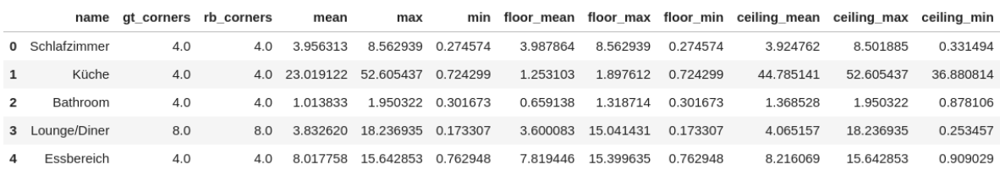
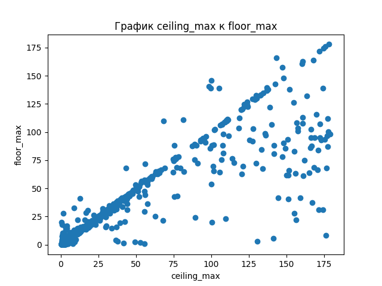
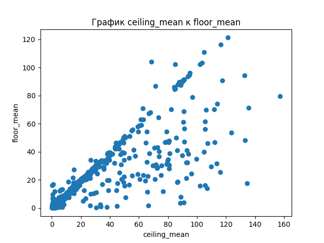
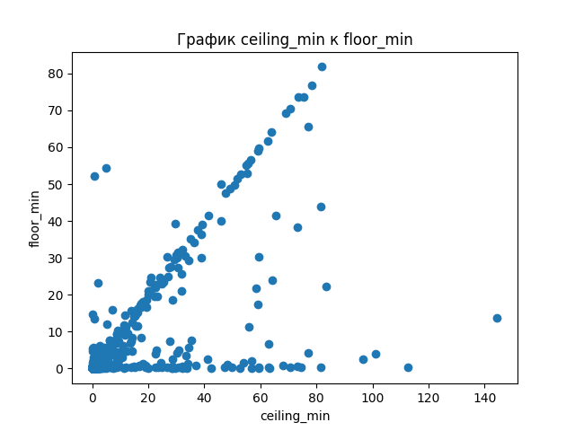
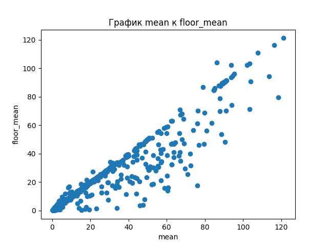
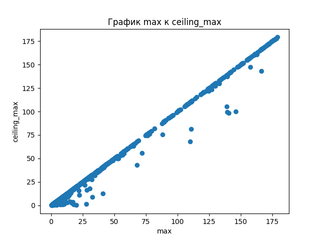
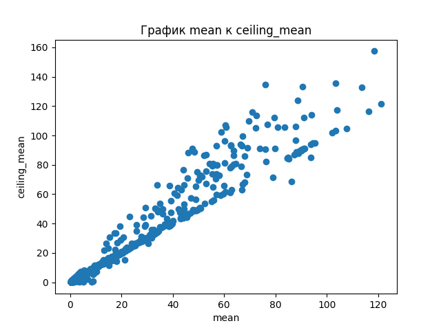
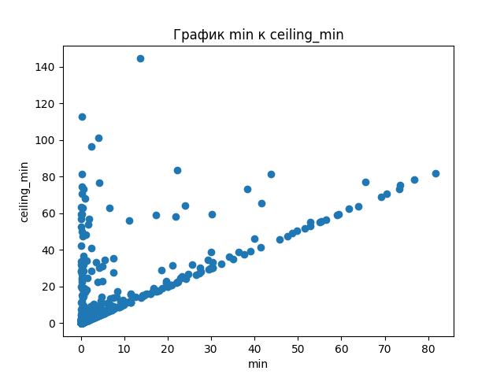
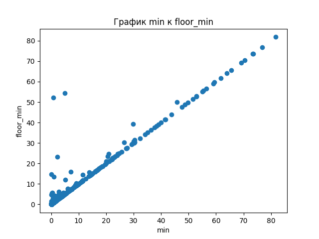
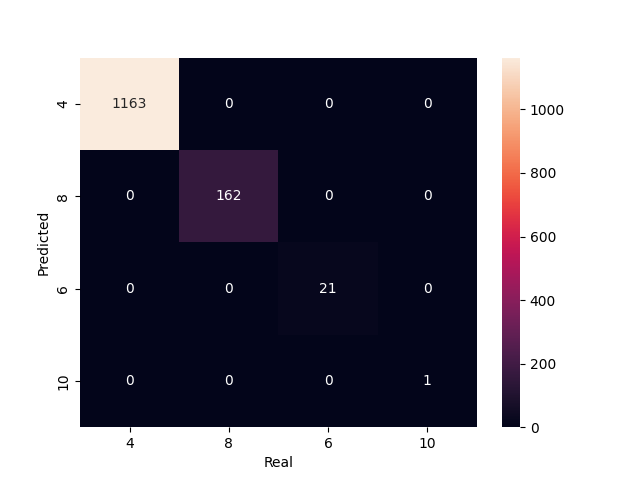

# Testing task
---
---

**Pandas json link** :
>https://ai-process-sandy.s3.eu-west-1.amazonaws.com/purge/deviation.json
***
**Context**:
>These are deviations of floor vs ceiling corners of one of our models with ground truth labels
for the room name and number of corners in that room with predictions. Please **create
meaningful statistics of how well the model performed**.
***
**Data**

* Gt_corners = ground truth number of corners in the room
* Rb_corners = number of corners found by the model
* Mean max min and all others are deviation values in degrees.
***

**Tasks**:
1. Create project in idea, pycharm or vscode
2. Create requirements.txt and virtual env
3. Create class for drawing plots
4. Create function “draw_plots”:
    * reads json file passed as parameter as a pandas dataframe
    * draws plot for comparing different columns
    * saves plots in a folder called “plots”
    * returns paths to all plots
5. Create jupyter notebook called Notebook.ipynb in the root directory to call and visualize our
   plots
6. Publish the project on github
7. Email us with link to your project
***
   ######Nb if something is not clear do not hesitate to ask

### The first you need:
in terminal:
   * '$ pip install -r requirements.txt'
   * '$ virtualvenev venvironment'
   * '$ venvironment/Scripts/activate'
   * '$ python main.py'

## Total plots:
On the last plot we can see that model gave good result(100% predict)

